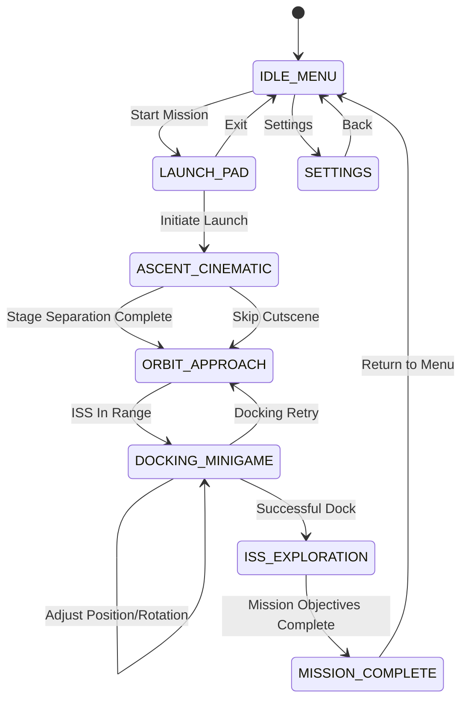

# Product Requirement Document (PRD)
## Space Simulator: Earth to ISS Journey

**Dokumen:** Technical Product Requirement Document  
**Product Type:** Interactive 3D Web Game / Educational Experience  
**Primary Technology:** Babylon.js, TypeScript/JavaScript, WebGL/WebGPU  
**Asset Format:** GLB/glTF, Draco/Meshopt, WebP/KTX2  
**Audio:** Web Audio API / Babylon Audio Engine  
**Target Platform:** Desktop Browser & Mobile Browser

---

# 1. Executive Summary & Success Metrics

## 1.1 Product Vision

**Space Simulator: Earth to ISS Journey** adalah pengalaman 3D interaktif yang memungkinkan pemain berperan sebagai astronot dalam perjalanan:

`Launch Preparation → Rocket Launch → Atmospheric Ascent → Orbit → ISS Docking → ISS Interior Exploration`

Pengalaman bersifat sinematik pada peluncuran, kemudian berubah menjadi interaktif pada pendekatan ISS, docking, dan eksplorasi interior.

## 1.2 Product Goals

1. Memberikan pengalaman visual 3D yang imersif.
2. Menggabungkan cinematic sequence dengan gameplay interaktif.
3. Menyediakan simulasi docking sederhana namun mudah dimainkan.
4. Menyediakan eksplorasi zero-G di dalam ISS.
5. Mendukung desktop dan mobile browser.
6. Menggunakan lazy loading agar first-load ringan.
7. Memiliki fallback rendering berdasarkan kemampuan perangkat.

**Non-goals MVP:** simulasi aerospace training-grade, multiplayer, full EVA/spacewalk, dan simulasi life-support lengkap.

## 1.3 Success Metrics

| Metric | Target |
|---|---:|
| Desktop FPS | ≥ 60 FPS |
| Mobile FPS | ≥ 30 FPS |
| Initial JS bundle | ≤ 2.5 MB compressed |
| Initial 3D payload | ≤ 5 MB compressed |
| Scene transition | ≤ 3–5 detik target |
| Loading feedback | 100% scene loading |
| Crash rate | < 1% session |
| Context-loss recovery | ≥ 95% recovery attempt |
| Input response | < 100 ms perceived |
| Main-thread budget @60 FPS | ~16.7 ms |

### Memory Budget

**High-end Desktop**
- GPU/asset footprint target: ≤ 1.5–2 GB
- JS heap target: ≤ 500 MB

**Mid-range Mobile**
- GPU target: ≤ 500–700 MB
- JS heap target: ≤ 250 MB

**Low-end Mobile**
- GPU target: ≤ 300–400 MB
- JS heap target: ≤ 180–200 MB

### Quality Tiers

**HIGH:** WebGPU preferred, 2K/4K hero textures, full post-processing, higher particle count, high-quality shadows, higher LOD.

**MEDIUM:** WebGPU/WebGL2, 2K textures, reduced particles/post-processing/shadows, medium LOD.

**LOW:** WebGL2, 512–1024 textures, minimal particles, no expensive motion blur, simplified atmosphere/materials, aggressive LOD.

---

# 2. User Flow & State Machine

## 2.1 Primary Flow

```text
IDLE_MENU
   ↓
LAUNCH_PAD
   ↓
ASCENT_CINEMATIC
   ↓
ORBIT_APPROACH
   ↓
DOCKING_MINIGAME
   ↓
ISS_EXPLORATION
   ↓
MISSION_COMPLETE
```

## 2.2 Mermaid State Diagram



## 2.3 State Responsibilities

### `IDLE_MENU`
Initialize engine, detect WebGL/WebGPU, detect device tier, initialize audio/input, preload UI assets.

### `LAUNCH_PAD`
Spawn rocket, launch environment, ambient atmosphere, steam/cooling particles, countdown, launch audio timeline.

### `ASCENT_CINEMATIC`
Control deterministic rocket trajectory, cinematic cameras, audio synchronization, exhaust, atmospheric effects, stage separation.

### `ORBIT_APPROACH`
Activate Earth, ISS, orbital environment, relative spacecraft positioning, transition to interactive camera.

### `DOCKING_MINIGAME`
Six-axis movement abstraction, relative position/orientation, velocity control, docking corridor, alignment reticle, success/failure.

### `ISS_EXPLORATION`
First-person zero-G, collision, free-look, flashlight, interactions, checkpoints, Cupola.

---

# 3. System Architecture

```text
Website Shell
│
├── Game Entry Point
│   └── SpaceSimulatorApp
├── Core
│   ├── GameStateManager
│   ├── SceneManager
│   ├── AssetManager
│   ├── AudioManager
│   ├── InputManager
│   └── PerformanceManager
├── Scenes
│   ├── MenuScene
│   ├── LaunchPadScene
│   ├── AscentScene
│   ├── OrbitScene
│   ├── DockingScene
│   └── ISSInteriorScene
├── Gameplay
│   ├── RocketController
│   ├── OrbitalController
│   ├── DockingController
│   ├── ZeroGController
│   └── InteractionController
├── Rendering
│   ├── CameraDirector
│   ├── EnvironmentRenderer
│   ├── ParticleManager
│   └── PostProcessManager
└── UI
    ├── HUDManager
    ├── CountdownHUD
    ├── TelemetryHUD
    ├── DockingHUD
    └── InteractionPrompt
```

## 3.1 Suggested TypeScript Structure

```text
src/
├── core/
│   ├── Game.ts
│   ├── GameStateManager.ts
│   ├── SceneManager.ts
│   ├── AssetManager.ts
│   ├── AudioManager.ts
│   └── PerformanceManager.ts
├── scenes/
│   ├── LaunchPadScene.ts
│   ├── AscentScene.ts
│   ├── OrbitScene.ts
│   ├── DockingScene.ts
│   └── ISSScene.ts
├── gameplay/
│   ├── RocketController.ts
│   ├── DockingController.ts
│   ├── ZeroGController.ts
│   ├── InteractionController.ts
│   └── CheckpointSystem.ts
├── cameras/
│   ├── CameraDirector.ts
│   ├── LaunchCameraRig.ts
│   └── DockingCameraRig.ts
├── rendering/
│   ├── AtmosphereRenderer.ts
│   ├── ParticleManager.ts
│   └── PostProcessManager.ts
├── ui/
│   ├── HUDManager.ts
│   ├── CountdownHUD.ts
│   └── DockingHUD.ts
└── assets/
    └── manifest.ts
```

---

# 4. Detailed Functional & Technical Specifications

## 4.1 Babylon.js Engine Initialization

Engine strategy:

```text
WebGPU capable
    ↓
Attempt WebGPU
    ↓
Success → WebGPU
Failure → WebGL2

WebGL2 unavailable
    ↓
Unsupported-device fallback
```

Recommended runtime:

```ts
const canvas = document.getElementById("space-canvas") as HTMLCanvasElement;

const engine = await createBestEngine(canvas);
const scene = new BABYLON.Scene(engine);

engine.runRenderLoop(() => scene.render());

window.addEventListener("resize", () => engine.resize());
```

Do not make gameplay dependent on WebGPU-only features.

## 4.2 Scene & AssetContainer Strategy

Use one main Babylon `Engine`. Scene separation should be logical and resource-oriented.

Preferred loading pattern:

```ts
const container =
    await BABYLON.SceneLoader.LoadAssetContainerAsync(
        "/assets/launch/",
        "launch-pad.glb",
        scene
    );

container.addAllToScene();
```

On transition:

```ts
container.removeAllFromScene();
```

Dispose only when resources are no longer needed.

## 4.3 Camera Management

### Launch Pad
Primary camera: `ArcRotateCamera`.

Use for hero framing and menu presentation.

### Ascent
Use `FreeCamera`/camera rigs.

- POV 1: Ground Camera — wide cinematic tracking shot.
- POV 2: Booster Camera — parented to booster, looking toward Earth.
- POV 3: Cockpit/Helmet Camera — `UniversalCamera`, interior vibration and screen shake.
- POV 4: Separation Camera — cinematic `FreeCamera`.

### Orbit
Use `UniversalCamera` or custom camera rig for spacecraft approach.

### ISS
Use `UniversalCamera` for first-person zero-G exploration.

## 4.4 Camera Director

Centralize cinematic transitions:

```ts
class CameraDirector {
    playShot(name: string): void {}
    blendTo(camera: BABYLON.Camera, duration: number): void {}
    shake(amplitude: number, duration: number): void {}
}
```

Shot sequence:

```text
SHOT_01_GROUND
→ SHOT_02_BOOSTER
→ SHOT_03_COCKPIT
→ SHOT_04_SEPARATION
→ SHOT_05_ORBIT
```

---

# 5. Scene 1 — Launch Pad & Countdown

## Visual Requirements

- Launch tower
- Rocket
- Service arm
- Ground platform
- Lighting
- Environmental fog
- Sky
- Steam pipes

Particle systems:

```text
CoolingSteam
EnginePreIgnitionSmoke
LaunchSmoke
EngineFlame
AtmosphericTrail
```

GPU particles should be preferred when appropriate; reduce count on LOW tier.

## Countdown

```text
COUNTDOWN_READY
↓
10 → 9 → ... → 3 → 2 → 1
↓
LIFTOFF
```

Countdown must be event-driven.

```ts
countdown.onTickObservable.add((value) => {
    hud.updateCountdown(value);
    audio.playCountdownBeep(value);
});
```

## Audio Timeline

```text
T-10   Mission Control Voice
T-09   Beep
...
T-03   Engine Ignition
T-02   Engine RPM Rise
T-01   Final Command
T+00   Liftoff
T+01   Camera Shake
T+03   Launch Rumble
```

Required interaction:

- `Initiate Launch`
- `Skip Cutscene`

---

# 6. Scene 2 — Rocket Ascent

## Rocket Motion

Use a deterministic gameplay trajectory instead of solving full aerospace launch dynamics.

```text
TrajectoryCurve
AltitudeProfile
PitchProgram
VelocityProfile
StageEvents
```

Example:

```ts
rocket.position = trajectory.getPosition(t);
rocket.rotation = trajectory.getRotation(t);
```

## Atmospheric Effects

Earth rendering:

```text
Earth
├── Surface
├── Clouds
└── Atmosphere Shell
```

Atmosphere shader inputs:

```text
View Direction
Normal
Sun Direction
Altitude Factor
```

Approximation:

```text
atmosphereIntensity =
    pow(1 - dot(viewDirection, normal), atmospherePower)
    * sunFactor
```

## Camera Shake Sources

```text
ENGINE_IGNITION
MAX_Q
TURBULENCE
STAGE_SEPARATION
DOCKING_CONTACT
```

Shake must be damped, deterministic, frame-rate independent, and disabled by Reduced Motion.

---

# 7. Scene 3 — Orbital Space & ISS Docking

## Earth

Use a sphere-based Earth with:

```text
Surface
Cloud Layer
Atmosphere
Night Lighting
Optional City Lights
```

Keep geometry low-poly and rely primarily on textures/shaders for surface detail.

## ISS Asset

Modular hierarchy:

```text
ISSRoot
├── Truss
├── SolarArrays
├── Columbus
├── Kibo
├── Cupola
├── Destiny
├── Unity
└── DockingPort
```

High-detail meshes should only be activated at interaction distance.

## Orbit Approach

```text
Far Orbit
↓
ISS Visible
↓
Approach Corridor
↓
Docking HUD
↓
Manual/Semi-Autonomous Docking
```

---

# 8. Docking Minigame

## Controls

### Desktop

```text
W/S   Forward/Backward
A/D   Left/Right
Q/E   Up/Down
Mouse X/Y   Rotation
Shift/Ctrl   Speed/Brake
```

### Mobile

```text
Left Joystick  → Translation
Right Joystick → Rotation
Buttons        → Brake / Auto Align / Dock
```

## Docking State

```ts
interface DockingState {
    distance: number;
    relativeVelocity: number;
    yawError: number;
    pitchError: number;
    rollError: number;
    alignmentScore: number;
}
```

## Success Criteria

```text
distance < 2.0 m
AND
relativeSpeed < 0.15 m/s
AND
yawError < 3°
AND
pitchError < 3°
AND
rollError < 3°
```

Difficulty:

**Easy:** auto-assist, larger tolerances.  
**Normal:** partial auto-align.  
**Hard:** manual six-axis control.

## Docking Sequence

```text
Tolerance Zone
↓
LOCK
↓
Cinematic Camera
↓
Velocity Dampening
↓
Capture Ring
↓
Contact
↓
Mechanical Lock
↓
Docked
```

---

# 9. Docking HUD

```text
┌─────────────────────────────┐
│        ISS DOCKING          │
│                             │
│             ◉               │
│                             │
│ DISTANCE     18.2 m         │
│ REL SPEED     0.38 m/s      │
│ YAW           +2.4°         │
│ PITCH         -1.1°         │
│ ROLL          +0.6°         │
│ ALIGNMENT       78%         │
└─────────────────────────────┘
```

Status:

```text
Red    = Unsafe
Yellow = Correcting
Green  = Dock-ready
```

---

# 10. Scene 4 — ISS Interior Exploration

## Zero-G Controller

Variables:

```text
velocity
angularVelocity
acceleration
drag
maxSpeed
```

Movement:

```ts
velocity += input * acceleration * deltaTime;
velocity *= drag;
position += velocity * deltaTime;
```

## Collision

Use simplified invisible collision meshes rather than highest-detail visual meshes.

Targets:

- Walls
- Equipment
- Doors
- Handrails
- Panels

## Interaction Interface

```ts
interface Interactable {
    id: string;
    interactionDistance: number;
    prompt: string;
    interact(): void;
}
```

Examples:

```text
Control Panel
Window
Cupola
Checkpoint
Equipment Rack
Tablet
Experiment Module
Camera
```

## Cupola Sequence

```text
Approach Cupola
↓
Interaction Prompt
↓
Activate
↓
Camera Transition
↓
HUD Fade
↓
Earth View
↓
Ambient Audio Transition
```

Optional labels:

```text
Earth
Pacific Ocean
Atmosphere
Night Side
Solar Terminator
```

---

# 11. Asset Pipeline

## Primary Format

```text
GLB / glTF 2.0
```

Compression:

```text
Geometry: Draco or Meshopt
Textures: WebP / KTX2 where supported
Animation: glTF Animation
```

## Naming Convention

```text
rocket_main_v01.glb
rocket_booster_v01.glb
iss_cupola_v02.glb
iss_interior_destiny_v01.glb
earth_surface_2k.ktx2
rocket_flame_fx_v01.glb
```

## Texture Rules

| Asset | Max Resolution |
|---|---:|
| Rocket hero | 4K |
| ISS exterior hero | 4K |
| ISS interior | 2K |
| Small props | 512–1024 |
| LOW tier | 512–1024 |

## Material Rules

Default to PBR materials.

Use:

- Base Color
- Metallic
- Roughness
- Normal
- Emissive where required

Avoid excessive unique materials and shader variants.

## LOD

```text
LOD 0: 0–50 m
LOD 1: 50–250 m
LOD 2: 250 m+
```

ISS and Earth should each have tuned LOD levels. Actual thresholds must be validated by profiling.

## Instancing

Use instancing/thin instances for:

- Lights
- Panels
- Bolts
- Handrails
- Small equipment
- Ceiling fixtures

---

# 12. Shaders & Environment

## Atmosphere Shader

Vertex inputs:

```text
World Position
Normal
```

Fragment inputs:

```text
View Direction
Sun Direction
Atmospheric Density
Horizon Factor
```

Optional Rayleigh/Mie approximation may be added after MVP.

## Space Environment

Use:

```text
Procedural/texture star field
+
Sun directional light
+
Earth light approximation
```

Avoid thousands of dynamically updated star meshes.

## PBR Lighting

Interior:

```text
PBR
+
Environment Lighting
+
Emissive Fixtures
```

Exterior:

```text
Sun Directional Light
+
Environment Lighting
+
Rim Lighting
```

## Post Processing

### HIGH

```text
Glow/Bloom
Color Correction
Tone Mapping
Film Grain
Subtle Chromatic Aberration
Motion Blur — cinematic only
Vignette
```

### MEDIUM

```text
Glow/Bloom
Color Correction
Vignette
```

### LOW

```text
Color Correction
Minimal Vignette
```

---

# 13. Audio Engine

## Audio Architecture

```text
AudioManager
├── MusicBus
├── VoiceBus
├── SFXBus
├── EnvironmentBus
└── UIAudioBus
```

Audio states:

```text
LAUNCH
ASCENT
ORBIT
DOCKING
ISS_INTERIOR
```

## Exterior Audio Design

Because real vacuum does not transmit ordinary sound, exterior audio should be intentionally cinematic:

```text
Radio
Mission Control
Cockpit Systems
Internal Vibration
Cinematic Low-Frequency Effects
```

Avoid treating external engine sound as ordinary sound propagation through vacuum.

## Interior Audio

Use spatial audio for:

- Ventilation
- Equipment
- Control panels
- Alarms
- Mechanical systems

Mission Control voice should be non-positional/radio-like.

## Audio Ducking

When voice-over plays:

```text
Voice     0 dB
SFX      -4 dB
Music    -8 dB
Ambient  -5 dB
```

When entering ISS:

```text
Exterior ambience → 0%
Interior ambience → 100%
```

Use smooth ramps.

---

# 14. UI/UX & HUD

## Main Menu

```text
┌──────────────────────────────┐
│                              │
│       SPACE SIMULATOR        │
│      EARTH → ISS JOURNEY     │
│                              │
│      [ START MISSION ]       │
│                              │
│      [ SETTINGS ]            │
│      [ CREDITS ]             │
└──────────────────────────────┘
```

## Launch HUD

```text
┌──────────────────────────────┐
│ MISSION: EARTH → ISS         │
│                              │
│             T-10             │
│                              │
│ [ INITIATE LAUNCH ]          │
│                              │
│                   [ SKIP ]   │
└──────────────────────────────┘
```

## Ascent Telemetry

```text
ALT       84,230 m
VELOCITY   5,920 m/s
PITCH          38.2°
YAW             0.2°
STAGE              2
ENGINE         NOMINAL
```

## ISS Interaction HUD

Desktop:

```text
[ E ] INTERACT
```

Mobile:

```text
[ INTERACT ]
```

## UX Principles

1. Cinematic scenes minimize UI.
2. Gameplay scenes expose required telemetry.
3. No permanent HUD clutter.
4. Critical warnings combine visual + audio feedback.
5. Mobile uses large touch targets.
6. Interaction feedback is immediate.
7. Camera transitions are intentional.

Recommended minimum touch target: 44 × 44 CSS px; preferred 48 × 48 CSS px or larger.

---

# 15. Input System

Use a common abstraction:

```ts
interface InputState {
    moveX: number;
    moveY: number;
    moveZ: number;
    lookX: number;
    lookY: number;
    boost: boolean;
    brake: boolean;
    interact: boolean;
}
```

Adapters:

```text
KeyboardMouseInput
TouchInput
GamepadInput
```

Gameplay code must consume `InputState`, not directly query browser input events.

---

# 16. Performance Optimization

## 16.1 Lazy Loading

Initial:

```text
Engine
UI
Menu environment
Minimal audio
```

After Start:

```text
Launch assets
```

During ascent:

```text
Orbit assets
```

Near docking:

```text
ISS exterior
Docking assets
```

After docking:

```text
ISS interior
```

## 16.2 Predictive Preloading

```text
LaunchPad
  └── preload Orbit

Ascent
  └── preload Docking

Docking
  └── preload ISS Interior
```

## 16.3 Loading Indicator

```text
LOADING MISSION ASSETS...

Rocket         ██████████ 100%
Atmosphere     ████████░░  80%
Audio          ██████████ 100%
Next Scene     ████░░░░░░  40%

Preparing launch...
```

## 16.4 Dynamic Resolution

If FPS falls:

```text
60 → 50 FPS
↓
Reduce render scale 5–10%
```

If:

```text
< 40 FPS
```

then:

```text
Disable motion blur
Reduce particles
Reduce shadows
Simplify atmosphere
```

## 16.5 Draw Calls

Prioritize:

```text
GPU Instancing
Mesh merging where appropriate
Material sharing
LOD
Frustum culling
Thin instances
```

## 16.6 Particle Budgets

| Tier | Starting Budget |
|---|---:|
| HIGH | 5,000–20,000 |
| MEDIUM | 2,000–8,000 |
| LOW | 500–2,000 |

Tune these through real-device profiling.

## 16.7 Shadow Budget

| Tier | Shadow Map |
|---|---:|
| HIGH | 2048–4096 |
| MEDIUM | 1024–2048 |
| LOW | 512–1024 |

Only hero objects should cast high-quality shadows.

---

# 17. Error Handling

## WebGL/WebGPU Initialization

Fallback:

```text
3D_ENGINE_UNAVAILABLE
```

Message:

```text
Your browser/device cannot run this 3D experience.

Try:
• Latest Chrome/Edge/Firefox/Safari
• Enable hardware acceleration
• Use a more powerful device
```

## Context Lost

```text
RUNNING
↓
CONTEXT_LOST
↓
RECOVERING
↓
RESTORE_SCENE
↓
RUNNING
```

Recovery should rebuild/reload GPU resources as required.

## Asset Loading Error

```text
Retry once
↓
Fallback asset
↓
Graceful error if still failing
```

Never leave the user on an infinite loading screen.

## Audio Failure

Game remains playable if audio initialization fails. Audio is disabled and a status/mute indicator is shown.

---

# 18. Save & Progress

MVP persistence can use `localStorage`.

```ts
interface MissionProgress {
    lastCheckpoint: string;
    dockingCompleted: boolean;
    issExplorationCompleted: boolean;
}
```

Checkpoints:

```text
CHECKPOINT_LAUNCH
CHECKPOINT_ORBIT
CHECKPOINT_DOCKED
CHECKPOINT_ISS
```

---

# 19. Accessibility

Required:

- Mission-control captions
- Skip cinematic
- Reduced-motion setting
- UI scaling
- High-contrast HUD
- Remappable controls where feasible
- Audio mute
- Separate music/SFX/voice controls

Reduced motion:

```text
Screen shake = OFF
Motion blur = OFF
Camera transitions = SHORT
```

---

# 20. Analytics

Events:

```text
mission_started
launch_initiated
launch_completed
cinematic_skipped
orbit_reached
docking_started
docking_failed
docking_success
iss_entered
cupola_viewed
mission_completed
asset_load_failed
context_loss
```

Primary funnel:

```text
Start
↓
Launch
↓
Orbit
↓
Docking
↓
ISS
↓
Complete
```

Primary metric:

**Mission Completion Rate**

Secondary metrics:

- Docking Success Rate
- Scene Drop-off Rate
- Average Session Duration
- Mobile Completion Rate
- Asset Load Failure Rate

---

# 21. Website Integration

The game must be isolated from the host website.

```text
Website
└── Space Simulator Container
    ├── Canvas
    ├── Game UI
    └── Runtime
```

Expose a minimal API:

```ts
interface SpaceSimulatorAPI {
    start(): void;
    pause(): void;
    destroy(): void;
    setQuality(level: QualityTier): void;
}
```

Do not expose internal engine objects globally.

---

# 22. Technical Acceptance Criteria

## Engine

- [ ] Babylon.js initializes successfully.
- [ ] WebGPU attempted where supported.
- [ ] WebGL2 fallback works.
- [ ] Canvas resize works.
- [ ] Mobile orientation handled.

## Launch

- [ ] Rocket visible on launch pad.
- [ ] Countdown 10 → 1 works.
- [ ] Mission-control voice synchronized.
- [ ] Steam/smoke works.
- [ ] Ignition and camera sync.
- [ ] Skip cinematic works.

## Ascent

- [ ] Four camera shots implemented.
- [ ] Camera transitions smooth.
- [ ] Deterministic trajectory.
- [ ] Stage separation.
- [ ] Rocket exhaust.
- [ ] Screen shake toggle.

## Orbit

- [ ] Earth atmosphere visible.
- [ ] ISS becomes visible.
- [ ] Spacecraft enters orbital mode.
- [ ] Camera becomes interactive.

## Docking

- [ ] Docking UI activates.
- [ ] Position/rotation control.
- [ ] Distance/velocity displayed.
- [ ] Alignment score works.
- [ ] Docking lock animation.
- [ ] Retry works.

## ISS

- [ ] First-person controller.
- [ ] Zero-G inertia.
- [ ] Interior collision.
- [ ] Flashlight.
- [ ] Interactive panels.
- [ ] Cupola interaction.
- [ ] Checkpoints.

---

# 23. Phased Implementation Roadmap

## Milestone 1 — Core Engine & Prototype Rocket Launch

Deliverables:

```text
Babylon Engine
State Machine
Scene Manager
Asset Manager
Launch Pad
Rocket
Countdown
Basic Particles
Launch Camera
Basic Audio
```

Exit:

```text
IDLE_MENU
↓
LAUNCH_PAD
↓
COUNTDOWN
↓
ROCKET_LIFTOFF
```

Target:

- Desktop ≥ 60 FPS
- Mid-range mobile ≥ 30 FPS

## Milestone 2 — Orbital Camera & Docking Mechanics

Deliverables:

```text
Earth
Atmosphere
ISS
Orbital Camera
Relative Motion Controller
Docking Controller
Docking HUD
Alignment System
Docking Success Sequence
```

Exit:

```text
Reach Orbit
→ Find ISS
→ Align
→ Control Velocity
→ Dock
```

## Milestone 3 — ISS Interior & Zero-G Controller

Deliverables:

```text
ISS Interior
Collision Meshes
Zero-G Controller
First-Person Camera
Flashlight
Interaction System
Control Panels
Checkpoint System
Cupola View
```

Exit:

```text
Exit spacecraft
→ Float through station
→ Interact
→ Reach checkpoints
→ View Earth
```

## Milestone 4 — Audio, SFX, Post-Processing & Optimization

Deliverables:

```text
Mission Control VO
Engine SFX
Radio Effects
Interior Ambience
Spatial Audio
Audio Ducking
Glow/Bloom
Film Grain
Selective Motion Blur
Camera Shake
LOD
Compression
Dynamic Resolution
LOW/MEDIUM/HIGH tiers
Context-loss recovery
Analytics
QA
```

Exit:

```text
Desktop: 60 FPS target
Mobile: 30 FPS target
No blocking asset load
No infinite loading
Graceful unsupported-device fallback
```

---

# 24. Recommended Engineering Backlog

## Epic A — Foundation

```text
A1 Engine bootstrap
A2 State machine
A3 Scene manager
A4 Asset manager
A5 Input abstraction
A6 Quality manager
A7 Performance telemetry
```

## Epic B — Launch

```text
B1 Launch pad environment
B2 Rocket asset
B3 Countdown
B4 Camera director
B5 Particle FX
B6 Launch audio
B7 Cutscene skip
```

## Epic C — Orbit

```text
C1 Earth
C2 Atmosphere
C3 Orbital scene
C4 ISS exterior
C5 Orbital camera
```

## Epic D — Docking

```text
D1 Docking controller
D2 Relative velocity
D3 Alignment system
D4 Docking HUD
D5 Docking animation
D6 Retry system
```

## Epic E — ISS

```text
E1 Interior environment
E2 Zero-G controller
E3 Collision
E4 Interaction
E5 Flashlight
E6 Cupola
E7 Checkpoints
```

## Epic F — Polish

```text
F1 Audio polish
F2 VFX polish
F3 Post-processing
F4 Mobile optimization
F5 Error recovery
F6 Analytics
F7 QA
```

---

# 25. Definition of Done

```text
✓ Functional
✓ No blocking runtime errors
✓ Desktop tested
✓ Mobile tested
✓ LOW/MEDIUM/HIGH tested
✓ Scene transitions tested
✓ Context-loss tested
✓ Asset failure tested
✓ Audio failure tested
✓ Performance profiled
✓ Memory profiled
✓ Responsive UI
✓ Cinematic skip
✓ Reduced motion
✓ Analytics verified
✓ QA completed
```

---

# 26. Final Product Architecture

```text
                    SPACE SIMULATOR
                           │
                  ┌────────┴────────┐
                  │                 │
             Game Core          UI System
                  │                 │
       ┌──────────┼──────────┐      │
       │          │          │      │
    Scenes     Gameplay    Audio    HUD
       │          │          │      │
       ├──────┬───┼─────┐    │      │
       │      │   │     │    │      │
    Launch  Orbit Dock  ISS  │      │
       │      │   │     │    │      │
       └──────┴───┴─────┴────┴──────┘
                       │
                   Babylon.js
                       │
              ┌────────┴────────┐
              │                 │
            WebGPU            WebGL2
              │                 │
         High/Mid Tier      Fallback Tier
```

## Core Architectural Principle

Pisahkan:

```text
CINEMATIC SYSTEM
GAMEPLAY SYSTEM
RENDERING SYSTEM
ASSET SYSTEM
AUDIO SYSTEM
UI SYSTEM
```

Perubahan pada satu subsystem tidak boleh memaksa perubahan pada subsystem lain.

---

# 27. Recommended MVP Vertical Slice

Untuk versi pertama yang realistis:

```text
Launch Pad
↓
Countdown
↓
Cinematic Ascent
↓
Orbit
↓
Docking Minigame
↓
1 ISS Module
↓
Cupola
↓
Mission Complete
```

Jangan langsung membangun seluruh ISS. Bangun satu vertical slice lengkap terlebih dahulu:

```text
1 Launch Environment
1 Rocket
1 Orbital Scene
1 Docking Port
1 ISS Module
1 Interaction Loop
```

Setelah vertical slice stabil, modul ISS dapat diperluas tanpa mengubah arsitektur inti.

---

# 28. Engineering Principles

1. **Modular by default.**
2. **Data-driven cinematic sequencing.**
3. **Lazy-load everything that is not needed immediately.**
4. **Never use high-detail visual meshes as collision meshes.**
5. **Never let audio failure block gameplay.**
6. **Never let asset loading produce an infinite loading state.**
7. **WebGPU is preferred, WebGL2 is the fallback.**
8. **Gameplay must remain deterministic where cinematic timing matters.**
9. **Performance budgets must be validated on real devices.**
10. **MVP prioritizes a complete vertical slice over asset quantity.**
